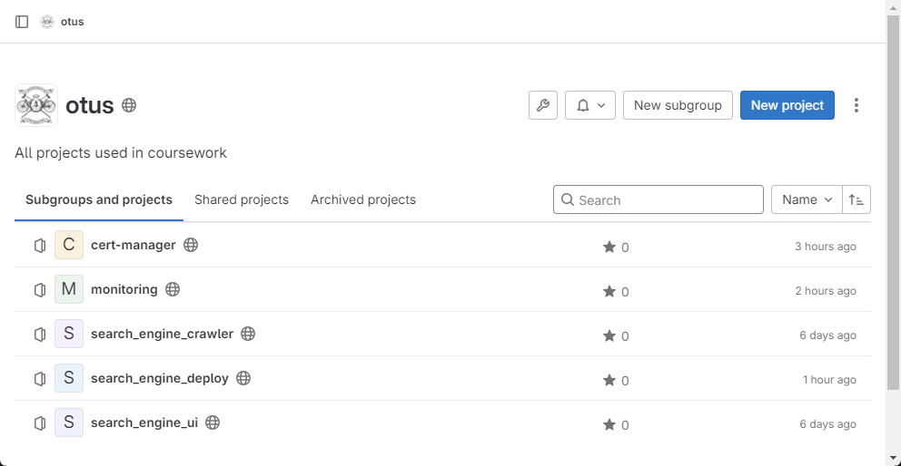
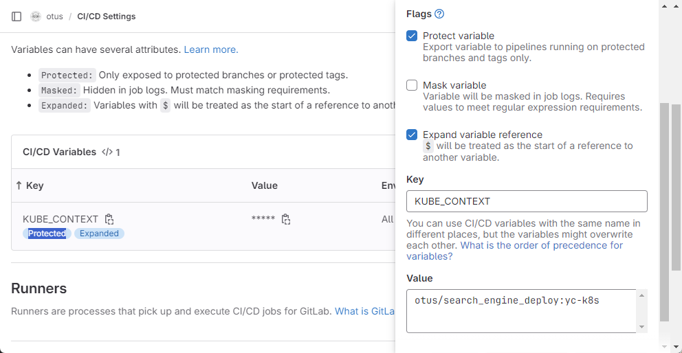
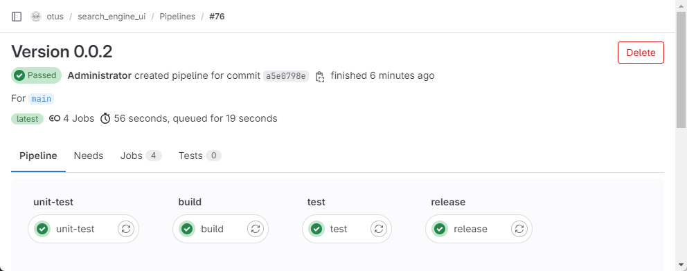
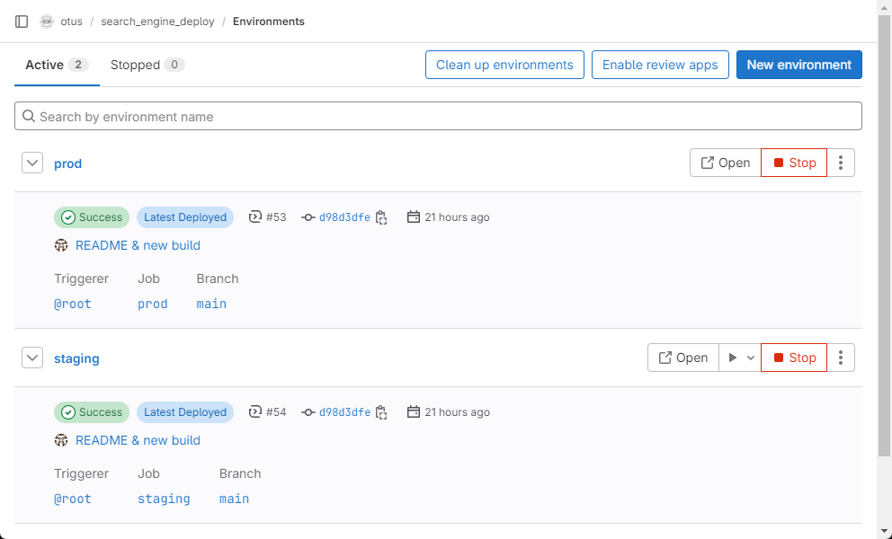
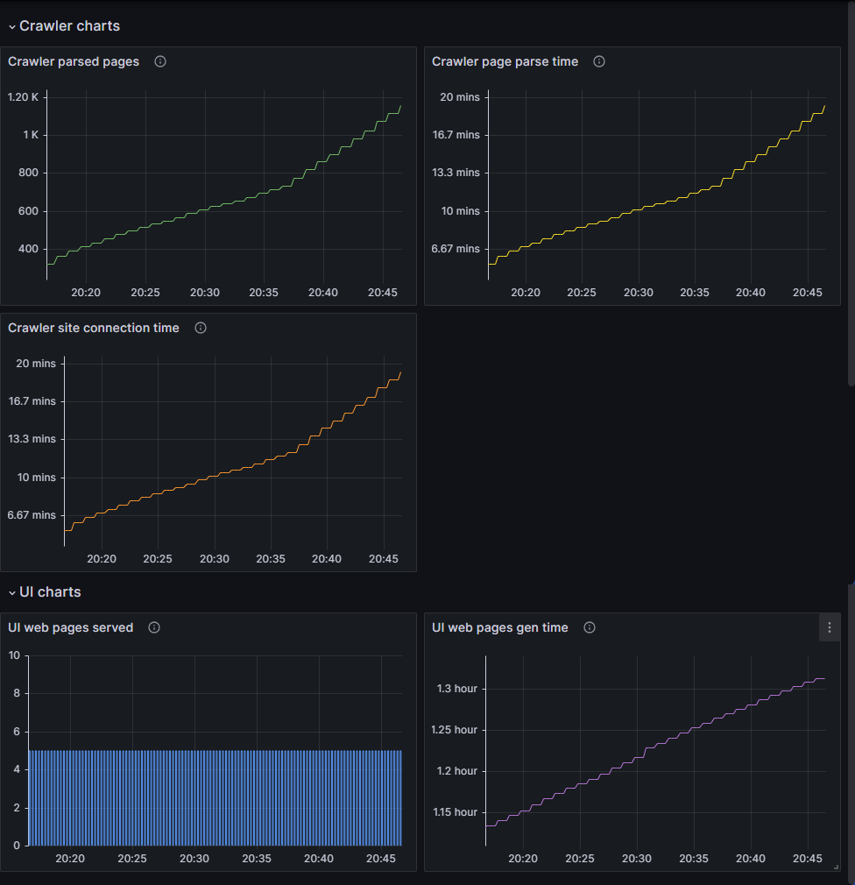
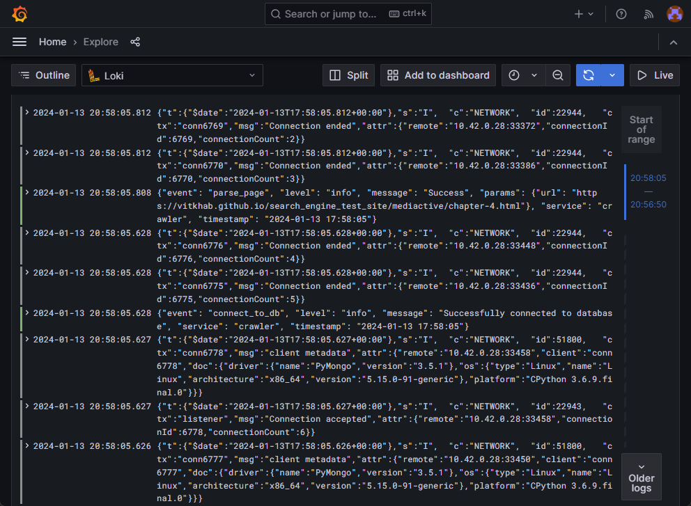
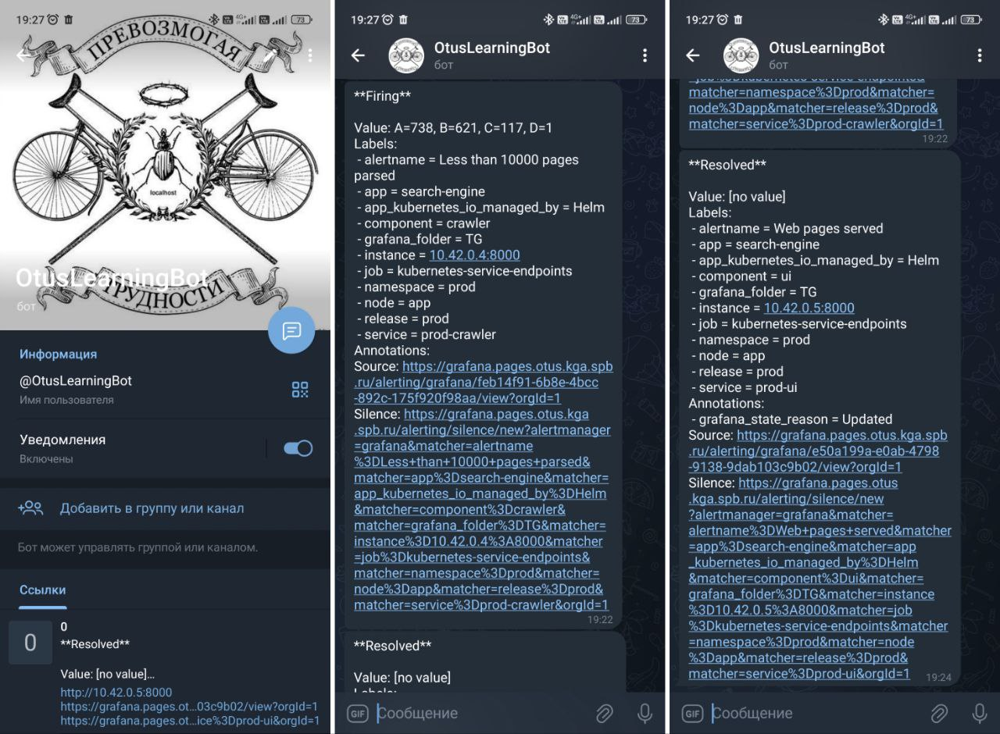

# Search Engine Deploy

> **Приложение живет по адресу <https://prod.pages.otus.kga.spb.ru/>**

Репозиторий содержит код и CI/CD pipeline для развертывание приложения в виде Helm Chart'а. Доставка осуществляется в кластер Kubernetes.

Код микросервисов `crawler` и `ui` вместе с пайплайнами сборки находятся в собственных GitLab репозиториях `search_engine_crawler` и `search_engine_ui` соответственно.



Репозитории `cert-manager` и `monitoring` содержат k8s манифесты, пайплайны и прочие файлы для развертывания в Kubernetes кластере приложения cert-manager и стека приложений для мониторинга (Grafana, Loki, Prometheus) соответственно.

## Хостинг репозиториев Git, CI/CD, registry

Для хранения и сборки проектов, а также хранения артефактов, развернут GitLab через официальный Helm Chart.

```
helm repo add gitlab https://charts.gitlab.io/
helm repo update

helm upgrade --install gitlab gitlab/gitlab \
  --namespace gitlab --create-namespace \
  --timeout 600s \
  --set global.hosts.domain=otus.kga.spb.ru \
  --set global.hosts.https=true \
  --set global.ingress.configureCertmanager=true \
  --set certmanager-issuer.email=shr@kga.spb.ru \
  --set gitlab.gitlab-shell.enabled=false \
  --set global.shell.port=2222 \
  --set global.kas.enabled=true \
  --set global.edition=ce \
  --set global.time_zone=Europe/Moscow \
  --set minio.replicas=1 \
  --set gitlab.gitlab-shell.replicaCount=1 \
  --set gitlab.sidekiq.replicas=1 \
  --set gitlab.webservice.replicaCount=1 \
  --set gitlab.webservice.workerProcesses=1 \
  --set postgresql.image.tag=13.6.0

kubectl get secret -n gitlab gitlab-gitlab-initial-root-password -ojsonpath='{.data.password}' | base64 --decode ; echo
```

> Проекты доступны по адресу https://gitlab.otus.kga.spb.ru/otus

## Хостинг приложения, мониторинг, TLS сертификаты

Для приложения развернут отдельный Kubernetes кластер с целью отработки навыков интеграции GitLab с внешними системами. Кластер с приложением подключен через GitLab Agent. Сам агент установлен через репозиторий проекта `search_engine_deploy`. В настройках агента `search_engine_deploy/.gitlab/agents/yc-k8s/config.yaml` разрешен доступ для всех проектов группы `otus`:
```
ci_access:
  groups:
    - id: otus
```

Переменная `KUBE_CONTEXT` с именем контекста Kubernetes кластера для подключения из GitLab Runner'ов определена для группы проектов `otus`. Переменной присвоен флаг `Protected`, чтобы выкатка в прод осуществлялась только для защищенных тэгов с указанием версии `v*`.



### Ingress-NGINX и Cert-manager

> Репозиторий https://gitlab.otus.kga.spb.ru/otus/cert-manager

Подключение к веб-интерфейсам приложения и системы мониторинга осуществляется через сетевой балансировщик на базе контроллера Ingress-NGINX по протоколу `https` с использованием TLS сертификатов Let's Encrypt.

Для этой цели первым делом в кластере устанавливается Ingress-NGINX контроллер из официального Helm Chart'а:
```
helm upgrade --install ingress-nginx ingress-nginx \
  --repo https://kubernetes.github.io/ingress-nginx \
  --namespace ingress-nginx --create-namespace
```

Следующим шагом осуществляется развертывание в кластер дополнения `Cert-manager` и объявление ресурсов центров сертификации (CA) типа `ClusterIssuer`. В данном проекте используется ClusterIssuer т.к. данный ресурс является глобальным объектом кластера, и область его видимости распространяется на все пространства имен.

Чтобы запустился пайплайн автоматического развертывания в кластере Cert-manager, необходимо выполнить `git push` в репозиторий `cert-manager` с тэгом соответствующим версии релиза данного дополнения. На текущий момент Latest релизом является `v1.13.3` (см. <https://github.com/cert-manager/cert-manager/releases/latest>). В результате выполнятся стадии пайплайна `deploy` (развернуть, или обновить Cert-manager) и `apply` (применить манифесты ресурсов ClusterIssuer). Если запушить в репозиторий изменения без тэга, выполняется только стадия `apply`.

### Search Engine Crawler

> Репозиторий <https://gitlab.otus.kga.spb.ru/otus/search_engine_crawler> <br>
> Образ `registry.otus.kga.spb.ru/otus/search_engine_crawler`

CI/CD пайплайн содержит следующие стадии:
- `unit-test` -- тестирование и генерация отчета о покрытии кода тестами;
- `build` -- сборка образа и размещение в Container Registry с тэгом `${CI_COMMIT_SHA}`;
- `test` -- шаг для тестирования образа, в нашем случае с учетом старого кода и потенциального наличия уязвимостей здесь ничего не делается;
- `release` -- публикация в Container Registry образа `search_engine_crawler` с тэгами `latest` и версией, взятой из файла `VERSION`.

Последний шаг `release` выполняется только при внесении изменений в ветку `main`.

При сборке образа в Dockerfile задаются значения по умолчанию для сканируемого URL'а (передается в качестве аргумента командной строки через `CMD`) и маска для исключения (переменная среды `EXCLUDE_URLS`):
```
FROM alpine:3.9
...
ENV EXCLUDE_URLS=.*github.com
ENTRYPOINT [ "python3", "-u", "crawler/crawler.py" ]
CMD [ "https://vitkhab.github.io/search_engine_test_site/" ]
```


### Search Engine UI

> Репозиторий <https://gitlab.otus.kga.spb.ru/otus/search_engine_ui> <br>
> Образ `registry.otus.kga.spb.ru/otus/search_engine_ui`

Аналогично компоненту Crawler, CI/CD пайплайн содержит следующие стадии:
- `unit-test` -- тестирование и генерация отчета о покрытии кода тестами;
- `build` -- сборка образа и размещение в Container Registry с тэгом `${CI_COMMIT_SHA}`;
- `test` -- шаг для тестирования образа, в нашем случае с учетом старого кода и потенциального наличия уязвимостей здесь ничего не делается;
- `release` -- публикация в Container Registry образа `search_engine_ui` с тэгами `latest` и версией, взятой из файла `VERSION`.

Последний шаг `release` выполняется только при внесении изменений в ветку `main`.



### Search Engine Deploy

> Репозиторий <https://gitlab.otus.kga.spb.ru/otus/search_engine_deploy>

Данный проект содержит финальное приложение `search-engine` в виде Helm Chart'а, состоящее из модулей (микросервисов) [`crawler`](#search-engine-crawler), [`ui`](#search-engine-ui), `mongodb`, `rabbitmq`. Каждый модуль описан в виде самостоятельного Helm Chart'а, которые подключаются в основной Chart в качестве зависимостей через `requirements.yaml`.

CI/CD пайплайн содержит следующие стадии:
- `test` -- шаг для тестирования, в нашем случае с учетом старого кода и потенциального наличия уязвимостей здесь ничего не делается;
- `staging` -- развертывание приложения в одноименные GitLab Environment и Kubernetes Namespace `staging`. Выполняется только при публикации в ветку `main`. URL адрес для окружения формируется из встроенных переменных `https://${CI_ENVIRONMENT_SLUG}.${CI_PAGES_DOMAIN}`. Т.е. в нашем случае адрес `staging` окружения <https://staging.pages.otus.kga.spb.ru/>. Для окружения автоматически генерируется Let's Entrypt TLS сертификат через `Cert-manager`.
- `prod` -- стадия выполняется вручную. Аналогично предыдущему шагу, выполняется развертывание приложения в одноименные GitLab Environment и Kubernetes Namespace `prod`. URL <https://prod.pages.otus.kga.spb.ru/> является адресом продакшн среды. Для окружения автоматически генерируется Let's Entrypt TLS сертификат через `Cert-manager`.



```
$ kubectl get all,cm,secret,ing -n prod

NAME                                READY   STATUS    RESTARTS      AGE
pod/prod-rabbitmq-97574f8f9-hpdpp   1/1     Running   1 (21h ago)   45h
pod/prod-mongodb-85564b5965-m7t8t   1/1     Running   1 (21h ago)   45h
pod/prod-crawler-7874446cd5-qzjf9   1/1     Running   0             21h
pod/prod-ui-66746bf954-s5nwt        1/1     Running   0             21h

NAME                    TYPE        CLUSTER-IP      EXTERNAL-IP   PORT(S)     AGE
service/prod-rabbitmq   ClusterIP   10.43.183.193   <none>        5672/TCP    45h
service/prod-mongodb    ClusterIP   10.43.176.192   <none>        27017/TCP   45h
service/prod-crawler    ClusterIP   10.43.81.196    <none>        8000/TCP    45h
service/prod-ui         ClusterIP   10.43.13.195    <none>        8000/TCP    45h

NAME                            READY   UP-TO-DATE   AVAILABLE   AGE
deployment.apps/prod-rabbitmq   1/1     1            1           45h
deployment.apps/prod-mongodb    1/1     1            1           45h
deployment.apps/prod-crawler    1/1     1            1           45h
deployment.apps/prod-ui         1/1     1            1           45h

NAME                                      DESIRED   CURRENT   READY   AGE
replicaset.apps/prod-rabbitmq-97574f8f9   1         1         1       45h
replicaset.apps/prod-mongodb-85564b5965   1         1         1       45h
replicaset.apps/prod-crawler-7874446cd5   1         1         1       21h
replicaset.apps/prod-ui-66746bf954        1         1         1       21h
replicaset.apps/prod-crawler-58769554f4   0         0         0       45h
replicaset.apps/prod-ui-687667dfcc        0         0         0       45h

NAME                         DATA   AGE
configmap/kube-root-ca.crt   1      45h

NAME                                TYPE                 DATA   AGE
secret/letsencrypt-prod-ui          kubernetes.io/tls    2      45h
secret/sh.helm.release.v1.prod.v1   helm.sh/release.v1   1      45h
secret/sh.helm.release.v1.prod.v2   helm.sh/release.v1   1      27h
secret/sh.helm.release.v1.prod.v3   helm.sh/release.v1   1      21h

NAME                                CLASS   HOSTS                        ADDRESS       PORTS     AGE
ingress.networking.k8s.io/prod-ui   nginx   prod.pages.otus.kga.spb.ru   10.129.0.23   80, 443   45h
```

#### Chart crawler

> https://gitlab.otus.kga.spb.ru/otus/search_engine_deploy/-/tree/main/crawler

Разворачиваются объекты `Deployment` и `Service`. В `values.yaml` определены внешний и внутренний порты сервиса, репозиторий и тэг образа по умолчанию, параметры подключения к MongoDB и RabbitMQ, а также значения по умолчанию переменных `CHECK_INTERVAL`, `EXCLUDE_URLS` и `URL`. В имена всех сущностей добавляется в качестве префикса имя текущего окружения (staging, prod).

В аннотациях метаданных `Service` задаются параметры сбора метрик для Prometheus:
```
...
metadata:
  annotations:
    prometheus.io/scrape: "true"
    prometheus.io/path: "/metrics"
    prometheus.io/port: "{{ .Values.service.externalPort }}"
...
```

#### Chart ui

> https://gitlab.otus.kga.spb.ru/otus/search_engine_deploy/-/tree/main/ui

Разворачиваются объекты `Deployment`, `Service` и `Ingress`. В `values.yaml` определены внешний и внутренний порты сервиса, репозиторий и тэг образа по умолчанию, класс объекта `Ingress`, параметры подключения к MongoDB. В имена всех сущностей добавляется в качестве префикса имя текущего окружения (staging, prod).

В аннотациях метаданных `Service` задаются параметры сбора метрик для Prometheus:
```
...
metadata:
  annotations:
    prometheus.io/scrape: "true"
    prometheus.io/path: "/metrics"
    prometheus.io/port: "{{ .Values.service.externalPort }}"
...
```

#### Chart mongodb

> https://gitlab.otus.kga.spb.ru/otus/search_engine_deploy/-/tree/main/mongodb

Разворачиваются объекты `Deployment` и `Service`. Используется официальный образ `mongo:4`. В имена всех сущностей добавляется в качестве префикса имя текущего окружения (staging, prod).

#### Chart rabbitmq

> https://gitlab.otus.kga.spb.ru/otus/search_engine_deploy/-/tree/main/rabbitmq

Разворачиваются объекты `Deployment` и `Service`. Используется официальный образ `rabbitmq:3.7-alpine`. В имена всех сущностей добавляется в качестве префикса имя текущего окружения (staging, prod).

## Мониторинг, метрики, логирование, оповещения

> Репозиторий <https://gitlab.otus.kga.spb.ru/otus/monitoring>

Проект `monitoring` содержит файл `monitoring-values.yaml` с параметрами для развертывания стека `loki-stack` из Helm Chart'а от Grafana в неймспейсе `monitoring`, а также файл `grafana-ingress.yaml` для развертывания объекта `Ingress` для доступа к веб-интерфейсу Grafana. URL адрес формируется из встроенной переменной `https://grafana.${CI_PAGES_DOMAIN}`. Т.е. в нашем случае адрес веб-интерфейса Grafana <https://grafana.pages.otus.kga.spb.ru/>. Для сайта автоматически генерируется Let's Entrypt TLS сертификат через `Cert-manager`.

Чтобы запустился пайплайн автоматического развертывания в кластере стека `loki-stack`, необходимо выполнить `git push` в репозиторий `monitoring` с тэгом соответствующим версии сборки, например `v24.1.13.1`. В результате выполнятся стадии пайплайна `deploy` (развернуть, или обновить стек `loki-stack`) и `apply` (применить манифест объекта Ingress для доступа к веб-интерфейсу Grafana). Если запушить в репозиторий изменения без тэга, выполняется только стадия `apply`.

### Метрики

Для сбора метрик в аннотациях метаданных `Service` задаются параметры для Prometheus:
```
...
metadata:
  annotations:
    prometheus.io/scrape: "true"
    prometheus.io/path: "/metrics"
    prometheus.io/port: "{{ .Values.service.externalPort }}"
...
```

Файл `grafana-export/crawler-UI-dashboard.json` содержит настроенные дашборды Grafana для визуализации значений метрик `crawler_pages_parsed`, `crawler_page_parse_time_count`, `crawler_site_connection_time_count`, `web_pages_served`, `web_page_gen_time_sum` из неймспейса `prod`.



### Логирование

Дополнительной настройки `loki` не требуется, логи начинают отображаться в Grafana.

`{app="search-engine"}`



### Алерты

Для уведомлений в Grafana настроена Contact point с интеграцией в `Telegram`. Файл `grafana-export/TG-evaluation-group.yaml` содержит тестовые алерты, реагирующие на рост метрики `web_pages_served`, и чтобы скорость индексации страниц не падала ниже 100 за последние 5 минут. Алерты успешно приходят в Telegram.


